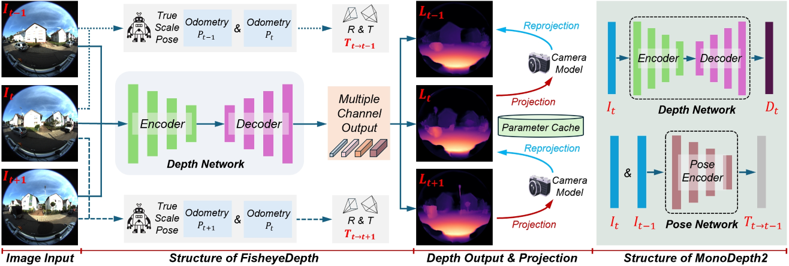
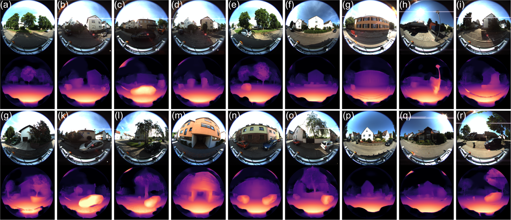
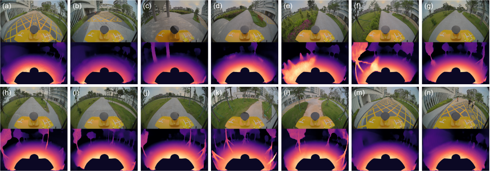

## :sunglasses: FisheyeDepth: A Real-Scale Self-Supervised Depth Estimation Model for Fisheye Cameras

[](https://arxiv.org/abs/2409.15054)
[](https://www.youtube.com/watch?v=SYICNArRfeI)
[](https://github.com/guoyangzhao/FisheyeDepth/pulls)

---

## 🔍 Overview

Fisheye cameras provide ultra-wide field-of-view (FOV), making them highly suitable for robotics and autonomous driving. However, severe geometric distortion and the lack of real-scale supervision pose significant challenges for depth estimation.

**FisheyeDepth** is a self-supervised depth estimation framework specifically designed for fisheye cameras, with the following key features:

- 📌 Geometry-aware fisheye projection modeling
- 📌 Real-scale pose supervision for metric depth
- 📌 Multi-scale adaptive depth decoding


## 🚀 Motivation

- **Wide FOV Advantage**: Fisheye cameras capture richer environmental context.
- **Distortion Challenge**: Strong distortion breaks pixel-wise geometric consistency.
- **Scale Ambiguity**: Conventional self-supervised methods lack real-world scale.


## 🧠 Framework

**Self-supervised depth estimation framework for fisheye cameras**

- A fisheye projection model is introduced to handle distortion explicitly.
- Real-scale poses are incorporated during training for metric depth prediction.
- A multi-channel decoder enables robust multi-scale feature fusion.

<p align="center">
  
</p>


## 📊 Results

### KITTI-360
<p align="center">
  
</p>

### Real-world Scenes
<p align="center">
  
</p>

More results can be found in the [Demo Video](https://www.youtube.com/watch?v=SYICNArRfeI)

---

## 📦 Data Preparation

### 1. KITTI-360 Dataset

Please download the official KITTI-360 dataset:

👉 https://www.cvlibs.net/datasets/kitti-360/

After downloading, organize the dataset following the expected directory structure.


### 2. Resized Fisheye Images (Recommended)

Training directly on original **1400×1400** fisheye images and resizing them online to **384×384** can significantly slow down training.

We recommend resizing images in advance: Resize fisheye images to 384×384 before training

We also provide preprocessed resized images:

👉 **Baidu Netdisk**: [LINK HERE]


## ⚙️ Environment Setup

We recommend using Conda:

```bash
conda create -n fisheyedepth python=3.8 -y
conda activate fisheyedepth

pip3 install -r requirement.txt
```


## 🏋️ Training

### 1. Configure Paths

Before training, modify:

```
configs/kitti360_fisheye.py
```

Set the following paths:

```python
path.kitti360_path   # original KITTI-360 dataset
path.resized_root    # resized fisheye images
path.base_path       # workspace base path
path.project_path    # project root
```


### 2. Run Training

```bash
./launcher/train.sh configs/kitti360_fisheye.py 0 $EXPERIMENT_NAME
```


## 📈 Evaluation

```bash
python3 scripts/test.py configs/kitti360_fisheye.py 0 $CHECKPOINT_PATH
```


## 🎨 Visualization

We provide visualization tools:

* Jupyter Notebook:

```
demos/fisheyedepth_demo.ipynb
```

* Script:

```
fisheyedepth_save_all_demo.py
```

---

## 🙏 Acknowledgement

This project is built upon:

* [FSNet](https://github.com/Owen-Liuyuxuan/FSNet)

We thank the authors for their excellent work.


## 📚 Citation

If you find this work useful, please consider citing:

```bibtex
@inproceedings{zhao2025fisheyedepth,
  title={Fisheyedepth: A real scale self-supervised depth estimation model for fisheye camera},
  author={Zhao, Guoyang and Liu, Yuxuan and Qi, Weiqing and Ma, Fulong and Liu, Ming and Ma, Jun},
  booktitle={2025 IEEE International Conference on Robotics and Automation (ICRA)},
  pages={3780--3787},
  year={2025},
  organization={IEEE}
}
```
```bibtex
@article{liu2023fsnet,
  title={FSNet: Redesign self-supervised MonoDepth for full-scale depth prediction for autonomous driving},
  author={Liu, Yuxuan and Xu, Zhenhua and Huang, Huaiyang and Wang, Lujia and Liu, Ming},
  journal={IEEE Transactions on Automation Science and Engineering},
  volume={21},
  number={3},
  pages={3955--3965},
  year={2023},
  publisher={IEEE}
}
```

## ⭐ Star

If this project helps your research, please consider giving a ⭐ on GitHub!


